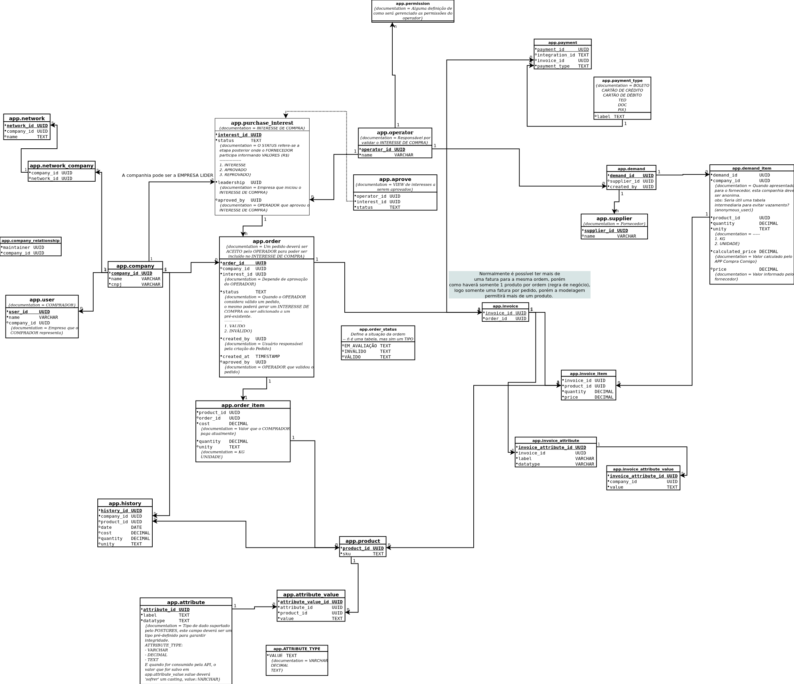

## Required

- docker
- sqitch
- vercel

## Sqitch: https://sqitch.org/

get docker image and script helper

```
docker pull sqitch/sqitch
curl -L https://git.io/JJKCn -o sqitch && chmod +x sqitch
./sqitch help
```

## Start the project (not needed right now)

init:

```sh
sqitch init ccapi \
    --engine pg \
    --target db:pg://dba:dba@db/ccapi \
    --uri https://github.com/compra-comigo/compra-comigo-api \
    --top-dir migrations
```

## Starting the database

```
docker-compose up -d
```

the database address will be: localhost:5432

## Running migrations

it will deploy from zero or from last migration

```
sqitch deploy
```

it will remove all tables and recreate from scratch

```sh
sqitch rebase
```

## Prisma

```sh
npx prisma introspect
```

```sh
npm run prisma:generate
```

```sh
npm run prisma:studio
```
## Developing

```sh
npm run dev
```

the API address will be: localhost:3000/api

## Production

```sh
vercel --prod
```

## Helpers

```sh
for i in $(git status|grep -v pgadmin|grep revert); do echo $i |awk -F '/' '{print $3}'| awk -F '.' '{print "-- Revert ccapi:"$1" from pg\nBEGIN;\n set search_path to ccapi;\n DROP TABLE "$1";\nCOMMIT;"}' > $i; done
```

## ER




